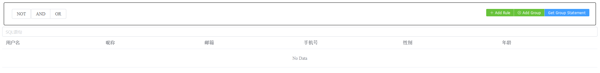
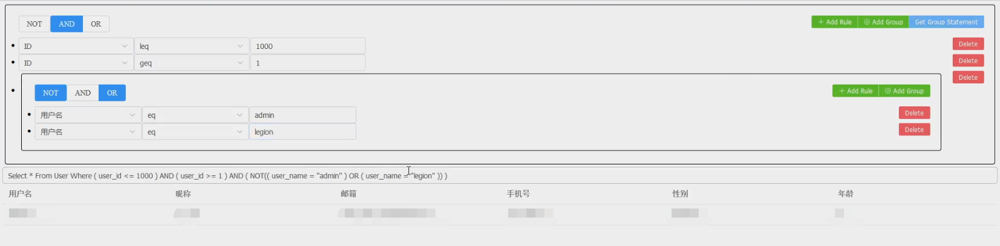

# Querybuilder
Inspired by [JQuerybuilder](https://querybuilder.js.org/)

一个仿照JQuerybuilder的个人Vue3项目练手作




## 调用
通过`<Group :attributes=<属性列表> :root="true">`调用

当Group从后端接收到数据时通过@spawn事件返回给父组件

样例：

```vue
<template>
  <Group :attributes="attributes" :root="true" @spawn="(param1,param2)=>receiveStatement(param1,param2)"/>
  <el-input v-model="sqlStatement" placeholder="SQL语句" />
  <SelectResult :table-data="tableData"/>
</template>

<script>
import Group from "@/components/Group.vue";
import SelectResult from "@/components/SelectResult.vue";
import axios from "axios";
export default{
  components: {SelectResult, Group},
  data(){
    return{
      sqlStatement:'',
      tableData:[],
      attributes:[
        {
          value:'user_name',
          label:'用户名',
        },
        {
          value:'user_id',
          label:'ID',
        },
        {
          value:'user_phone',
          label:'手机号码',
        },
        {
          value:'user_nickname',
          label:'昵称',
        },
        {
          value:'user_sex',
          label:'性别',
        },
        {
          value:'user_age',
          label:'年龄',
        },
      ]
    }
  },
  methods:{
    receiveStatement(statement,result){
      this.sqlStatement=statement;
      this.tableData=result;
    },
  }
}
</script>
```

## 接口
前端通过异步调用：
- 通过localhost:8080/statement/post向后端发送JSON对象并获取查询的表结果（List）
- 通过localhost:8080/statement/get向后端获取生成的SQL statement语句

## 返回JSON结构
前端通过localhost:8080/statement/post向后端发送如下格式的JSON对象，该对象为一个嵌套结构的语句表示
```JSON
{
  "is_rule":false,
  "is_not": false,
  "action": "AND",
  "rules": [
    {
      "is_rule": true,
      "condition": "eq",
      "left": "user_name",
      "right": "admin"
    },
    {
      "is_rule":false,
      "is_not": false,
      "action": "OR",
      "rules": [
        {
          ...
        },
        {
          ...
        }
      ]
    }
  ]
}
```